import RevealJS, { Slide } from '@site/src/components/RevealJS';
import Img from '@site/src/components/Img';
import PollSlide from '@site/src/components/PollSlide';

<RevealJS transition="slide">

{/* ============================================ */}
{/* COVER IMAGE */}
{/* ============================================ */}

<Slide>
  

<aside className="notes">
**Lecture overview:**
- **Total time:** ~55 minutes
- **Prerequisites:** L29 (GUIs in Java, event loop), L30 (MVVM, property binding), L12 (Domain Modeling)
- **Connects to:** L32 (Async/CompletableFuture), L33 (Event-Driven Architecture), GA1 (BackgroundTaskRunner)

**Structure (~22 slides):**
- Arc 1: Why Concurrency? + Week Roadmap (~10 min) — motivating scenario, three-lecture overview, concurrency vs parallelism
- Arc 2: Threads (~12 min) — creating threads, thread pools, interrupts
- Arc 3: The Problem — Shared Mutable State (~12 min) — race conditions, atomicity, Java Memory Model
- Arc 4: Solving It — Synchronization (~12 min) — synchronized, fine-grained locking, concurrent collections
- Arc 5: Deadlock (~8 min) — deadlock scenario, Coffman conditions, prevention
- Arc 6: Wrap-Up (~5 min) — comprehension check, takeaways, looking ahead

**Running example:** SceneItAll — the IoT/smarthome platform students know from L2, L13, L29, L30, Labs 11-12. IoT is a natural fit for concurrency: many devices, many users, many network calls, real-time state that must stay consistent.

> **Transition:** Let's start with the learning objectives...
</aside>

</Slide>

{/* ============================================ */}
{/* TITLE SLIDE */}
{/* ============================================ */}

<Slide>

# CS 3100: Program Design and Implementation II

## Lecture 31: Concurrency I — Threads and Synchronization

<p style={{marginTop: '2em', fontSize: '0.8em', color: '#666'}}>
  &copy;2026 Jonathan Bell, CC-BY-SA
</p>

<aside className="notes">
**Context from previous lectures:**
- L29: Built a SceneItAll area dashboard — introduced the event loop. "Long handlers freeze the UI."
- L30: MVVM, property binding, ObservableList, ViewModel testing. Students are deep in the SceneItAll domain.
- L12: Domain modeling — competing actions on the same domain objects. Today we see the technical version of that problem.
- Today: why concurrency matters, how threads work, what goes wrong with shared state, and how to fix it.

> **Transition:** Here's what you'll be able to do after today...
</aside>

</Slide>

{/* ============================================ */}
{/* LEARNING OBJECTIVES */}
{/* ============================================ */}

<Slide>

## Learning Objectives

<p style={{fontSize: '0.85em', textAlign: 'left'}}>
After this lecture, you will be able to:
</p>

<ol style={{fontSize: '0.75em', textAlign: 'left'}}>
  <li>Describe threads as a concurrency mechanism</li>
  <li>Recognize the need for synchronization and atomicity</li>
  <li>Utilize locks and concurrent collections to implement basic thread-safe code</li>
  <li>Understand deadlocks and race conditions</li>
</ol>

<aside className="notes">
**Time allocation:**
- Objective 1: Threads and thread pools (~12 min)
- Objective 2: Shared mutable state, race conditions, atomicity (~12 min)
- Objective 3: synchronized, concurrent collections (~12 min)
- Objective 4: Deadlock scenarios and prevention (~8 min)
- Wrap-up: comprehension check, takeaways (~5 min)

**Connection to GA1:** The GA1 handout provides `BackgroundTaskRunner` — students need to understand what it does internally. Today's concepts are the foundation.

> **Transition:** Let me set the scene...
</aside>

</Slide>

{/* ============================================ */}
{/* ARC 1: WHY CONCURRENCY? + WEEK ROADMAP (~10 min) */}
{/* ============================================ */}

<Slide>

## 50 Devices, 3 Users, 1 Hub

<div style={{fontSize: '0.8em'}}>

SceneItAll's hub manages **50 smart devices** — lights, fans, shades, thermostats — across a whole house.

Three family members walk in and activate scenes **simultaneously** from different rooms:

| User | Scene | Devices | Sequential time |
|------|-------|---------|----------------|
| Alice | "Evening" | 15 devices (dim lights, close shades) | ~5 sec |
| Bob | "Movie Night" | 8 devices (lights off, shades closed) | ~3 sec |
| Carol | "Study" | 6 devices (desk lamp on, overhead dim) | ~2 sec |

</div>

<div style={{fontSize: '0.85em', marginTop: '0.8em'}}>
<strong>Sequential:</strong> 10 seconds of delay — Alice waits, Bob waits longer, Carol waits longest.<br/>

<strong>Concurrent:</strong> All three scenes activate within ~5 seconds.

Remember L29: "long handlers freeze the UI." Same problem — now the hub <em>is</em> the UI.

</div>

<aside className="notes">
To be clear, we're not talking about JavaFX scenes.

→ This week is about concurrency...
</aside>

</Slide>

<Slide>

## The Concurrency Roadmap: This Week and GA1

<div style={{fontSize: '0.75em'}}>

| Lecture | Topic | The question it answers |
|---------|-------|------------------------|
| **L31 (Mon)** | Threads, shared state, synchronization, deadlock | *"Why does my GUI freeze when I load data?"* |
| **L32 (Wed)** | Async programming, CompletableFuture, `Platform.runLater()` | *"How do I load data in the background and update my GUI when it's ready?"* |
| **L33 (Thu)** | Event-driven architecture, consistency, resilience | *"What happens when the service I depend on is slow or down?"* |

</div>

<div style={{fontSize: '0.8em', backgroundColor: 'rgba(147,112,219,0.15)', padding: '0.8em', borderRadius: '8px', marginTop: '0.8em'}}>

**What you'll use in GA1:** When CookYourBooks loads recipes from the repository, that's I/O. If you do it on the main thread, your GUI freezes. The GA1 handout provides **`BackgroundTaskRunner`** — it wraps threads and FX-thread callbacks into `run(callable, onSuccess, onFailure)`. You don't write threading boilerplate, but you **must understand what it does internally** (your TA will ask).

</div>

<aside className="notes">
**The three-lecture arc:** L31 builds the mental model (threads, shared state, locks). L32 gives the practical tool (CompletableFuture, Platform.runLater). L33 zooms out to system-level coordination (events, consistency).

**BackgroundTaskRunner:** This is provided in the GA1 handout code. It wraps javafx.concurrent.Task with daemon threads and FX-thread callbacks. Students call `BackgroundTaskRunner.run(() -> loadData(), data -> updateUI(data), ex -> showError(ex))`. They don't write the threading code, but TAs will ask what happens under the hood during code walks.

**GA1 connection:** The concepts from this week directly address the "Handling asynchronous operations in a GUI context" learning outcome in GA1.

> **Transition:** Before we dive in, let's clarify two terms people often confuse...
</aside>

</Slide>

<Slide>

## Poll: Do multiple apps on your laptop take turns or run simultaneously?

<PollSlide username='espertus'
  choices={["they take turns", "they run at the same time", "some of both", "no idea"]}
/>

For example, you might have Spotify, VSCode, and Discord all open at once.

<aside className="notes">

</aside>

</Slide>

<Slide>

## Concurrency with and without Parallelism

<div style={{ fontSize: '.8em' }}>

**Concurrency**: a program or system with multiple overlapping tasks
* **Time-slicing**: a single core rapidly switching among tasks
* **Parallelism**: multiple cores simultaneously executing different tasks
</div>


<aside className="notes">

<p style={{fontSize: '0.8em', color: '#9370DB'}}>
Your laptop has ~8 cores but hundreds of threads running right now. You get <strong>both</strong>: parallelism across cores, concurrency within each core. The bugs we'll see today apply to all of it.
</p>

**Key distinction:** Concurrency is about *structure* — designing your program to handle multiple things. Parallelism is about *execution* — actually running things at the same time on multiple cores.

**The real world is row 3.** A modern laptop has 8-16 cores, but the OS is running hundreds of threads. Each core time-slices between many threads. You get parallelism (multiple cores) AND concurrency (many threads per core). This is why concurrency bugs are so hard to reproduce — the exact interleaving depends on how the OS schedules threads across cores, which varies every time.

**Analogy:** A single chef (1 core) can manage 3 dishes concurrently by switching between them. Three chefs (3 cores) can work on all three dishes in parallel. A real restaurant kitchen (8 cores, 50 orders) has both — chefs switch between dishes AND work in parallel. If two chefs grab the same pan, you have a problem regardless.

> **Transition:** Let's look at the mechanism Java gives us for concurrency...
</aside>

</Slide>

<Slide>

## Time-Slicing vs. Parallelism


<aside className="notes">

</aside>

</Slide>

<Slide>

## Multiple cores

<div style={{ fontSize: '.8em' }}>
Modern processors have multiple "cores" (mini-processors), each of which can
run a different task, giving true parallelism.

<div style={{display: 'flex', gap: '5rem', alignItems: 'center'}}>
  
  
</div>


Both parallelism and time-slicing are used.
</div>

<aside className="notes">
Left image is licensed from freepik and does not require attribution.
</aside>

</Slide>

<Slide>

## Poll: Do you use parallelism or time-slicing for taking multiple courses in a semester?

<PollSlide username='espertus'
  choices={["parallelism", "time-slicing", "both", "neither", "not sure" ]}
/>

<aside className="notes">

</aside>

</Slide>

{/* ============================================ */}
{/* ARC 2: THREADS (~12 min) */}
{/* ============================================ */}

<Slide>

## A Thread Is an Independent Path of Execution

<p style={{fontSize: '0.8em'}}>
Every Java program has a <strong>main thread</strong>. You can create additional threads that run simultaneously. Threads share the <strong>heap</strong> (device state, scene definitions) but have their <strong>own stack</strong> (local variables and call history).
</p>

<div style={{display: 'flex', gap: '2rem', alignItems: 'flex-start'}}>

<div style={{transform: 'scale(1.0)', transformOrigin: 'top left', flex: '0 0 auto'}}>
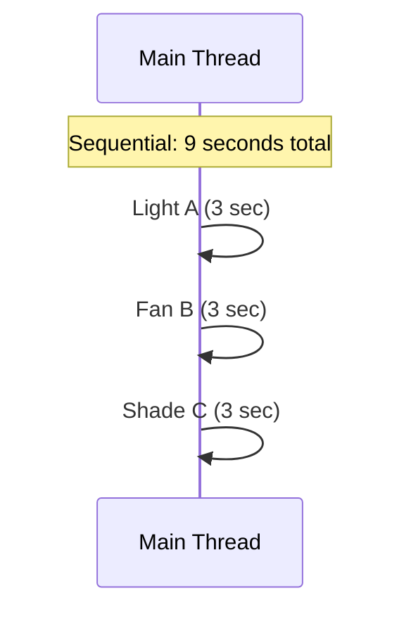

</div>

<div style={{transform: 'scale(2.4)', transformOrigin: 'top left', flex: '0 0 auto'}}>
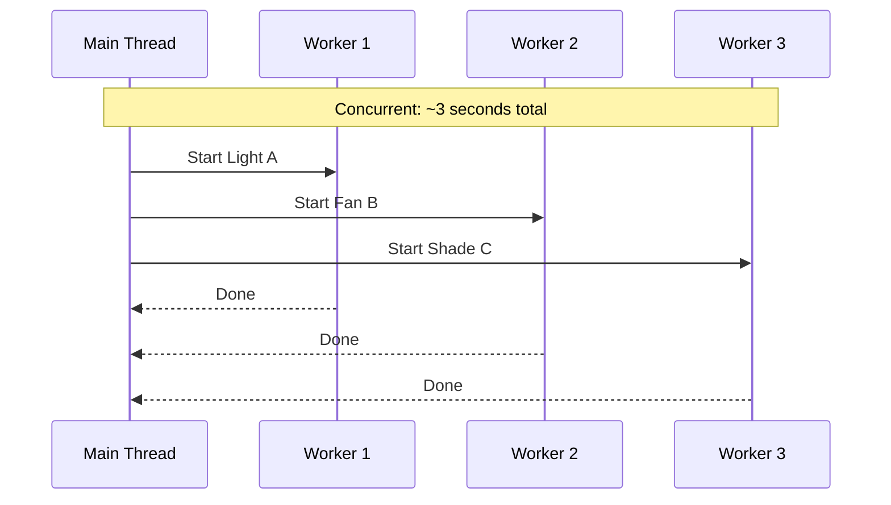

</div>

</div>

<aside className="notes">
**Shared heap, separate stacks:** This is the key mental model. The heap is where objects live — Device objects, Scene objects, the ConcurrentHashMap of registered devices. Every thread can see and modify these. The stack is local — each thread's method call frames, local variables, parameters. This is private to each thread.

**The shared heap is what makes concurrency dangerous.** If threads only used their own stacks, there would be no concurrency bugs. The problems start when two threads read and write the same heap objects.

> **Transition:** Let's see the three ways to create threads in Java...
</aside>

</Slide>

<Slide>

## Creating a thread

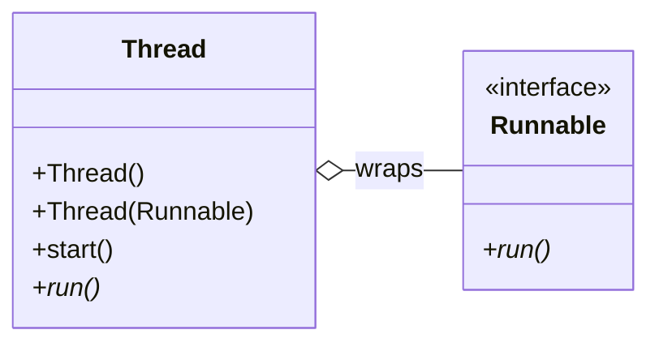

<div style={{ fontSize: '.7em' }}>
<p>1. Create a thread by:</p>
<ul style={{listStyleType: 'disc', marginLeft: '0em', marginTop: '-0.8em'}}>
  <li>subclassing <code>Thread</code> and overriding <code>run()</code></li>
  <li>implementing <code>Runnable</code> and passing that to the <code>Thread</code> constructor</li>
</ul>
<p>2. Call the <code>start()</code> method</p>
</div>
<aside className="notes">
**Option 3 (lambda) is what students will actually use.** But they need to know Options 1-2 to read legacy code and understand what's happening under the hood.

**Common misconception:** Calling `run()` directly does NOT start a new thread — it executes on the current thread. You must call `start()`. This is a classic exam question.

**But don't do any of these in production.** Next slide: thread pools. Creating raw threads is like opening raw sockets — you can, but you almost never should.

> **Transition:** But creating a thread per device command has problems...
</aside>

</Slide>

<Slide>

## Creating Threads 1: Extend Thread (not recommended)

<div style={{fontSize: '0.7em', transform: 'scale(0.8)', transformOrigin: 'top left'}}>
```java
// Extend Thread (not recommended — limits inheritance)
public class DeviceCommandSender extends Thread {
    private final DeviceCommand command;
    public DeviceCommandSender(DeviceCommand command) { this.command = command; }

    @Override
    public void run() {
        DeviceResponse response = sendViaZigbee(command);
        command.setResponse(response);
    }
}
new DeviceCommandSender(command).start();
```
<p>1. Create a thread by:</p>
<ul style={{listStyleType: 'disc', marginLeft: '2em', marginTop: '-0.8em'}}>
  <li>subclassing <code>Thread</code> and overriding <code>run()</code></li>
  <li>implementing <code>Runnable</code> and passing that to the <code>Thread</code> constructor</li>
</ul>
<p>2. Call the <code>start()</code> method</p>
</div>

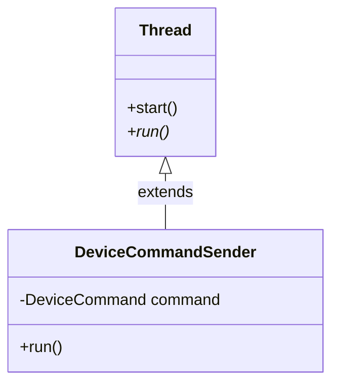

<br/><br/>

<aside className="notes">
**Not recommended** because it burns your one superclass. If `DeviceCommandSender` ever needs to extend something else (e.g. a base sensor class), you're stuck.
</aside>

</Slide>

<Slide>

## Creating Threads 2: Implement Runnable Explicitly

<div style={{fontSize: '0.75em'}}>
```java
// Implement Runnable (preferred — doesn't burn your one superclass)
public class DeviceCommandTask implements Runnable {
    private final DeviceCommand command;
    public DeviceCommandTask(DeviceCommand command) { this.command = command; }

    @Override
    public void run() {
        DeviceResponse response = sendViaZigbee(command);
        command.setResponse(response);
    }
}
Thread thread = new Thread(new DeviceCommandTask(command));
thread.start();
```

</div>
```mermaid
classDiagram
    direction LR
    class Runnable {
        <<interface>>
        +run()*
    }
    class DeviceCommandTask {
        -DeviceCommand command
        +run()
    }
    class Thread {
        +start()
        +run()
    }
    Runnable <|.. DeviceCommandTask : implements
    Thread o-- Runnable : wraps
    style Runnable fill:#2d4a5a,stroke:#4ac,stroke-width:2px,stroke-dasharray: 5 5
```

<aside className="notes">
**Preferred over Option 1.** Separates the task (what to do) from the thread (how to run it). `DeviceCommandTask` is just a plain object that happens to be runnable — it can be tested without a thread.
</aside>

</Slide>

<Slide>

## Creating Threads 3: Implement Runnable Implicitly

<div style={{fontSize: '0.75em'}}>
```java
// Lambda (most concise — use for simple tasks)
new Thread(() -> {
    DeviceResponse response = sendViaZigbee(dimLightsCommand);
    log.info("Light dimmed: " + response.getStatus());
}).start();
```

</div>
```mermaid
classDiagram
    direction LR
    class Runnable {
        <<interface>>
        +run()*
    }
    class Thread {
        +start()
        +run()
    }
    class λ {
        <<lambda>>
        +run()
    }
    Runnable <|.. λ : implements
    Thread o-- Runnable : wraps
    style Runnable fill:#2d4a5a,stroke:#4ac,stroke-width:2px,stroke-dasharray: 5 5
```

<p style={{fontSize: '0.75em', marginTop: '0.5em'}}>
A lambda is just an anonymous implementation of <code>Runnable</code> — syntactic sugar for Option 2. Prefer this for simple tasks; use a named class when the task needs fields or testing.
</p>

<aside className="notes">
**Option 3 is what students will actually use.** The lambda is compiled into an anonymous class that implements `Runnable` — it's identical to Option 2 under the hood.

**Common misconception:** Calling `run()` directly does NOT start a new thread — it executes on the current thread. You must call `start()`.

**But don't do any of these in production.** Next slide: thread pools. Creating raw threads is like opening raw sockets — you can, but you almost never should.

> **Transition:** But creating a thread per device command has problems...
</aside>

</Slide>

<Slide>

## Thread Pools: Reuse a Fixed Number of Threads

<div style={{fontSize: '0.75em'}}>

```java
public class HubCommandService {
    // A pool of 10 command worker threads
    private final ExecutorService executor = Executors.newFixedThreadPool(10);

    public void activateScene(Scene scene, Area room) {
        for (Device device : room.getDevices()) {
            executor.submit(() -> {
                DeviceState target = scene.getTargetState(device);
                DeviceResponse response = sendViaZigbee(
                    new DeviceCommand(device, target)
                );
                device.updateStatus(parseResponse(response));
            });
        }
    }

    public void shutdown() {
        executor.shutdown();
    }
}
```

</div>

<p style={{fontSize: '0.8em', marginTop: '0.5em'}}>
This creates a pool of 10 worker threads managed by an `ExecutorService`.

The first 10 requests start right away, but later requests have to wait until a thread is available.

It's kind of like a kitchen with 10 cooks.
</p>

<aside className="notes">
**Why not one thread per command?** Each thread costs 512KB-1MB of stack memory. For 15 commands, that's fine. But a hub with 200 devices, 10 users, and concurrent scene activations could spawn hundreds of threads — eating memory and causing excessive context switching.

**Thread pool benefits:**
- Reuses threads (no creation/destruction overhead per task)
- Bounds resource usage (at most 10 threads active)
- Queues excess work automatically
- Clean shutdown via `executor.shutdown()`

**The kitchen analogy:** A restaurant doesn't hire a new cook for every order. It has a fixed staff (the pool) and orders queue up on the pass. Same idea.

> **Transition:** What if a device stops responding?
</aside>

</Slide>

<Slide>

## Poll: Do Java threads run in parallel (at the same time)?

If there are ten concurrent threads, do they run in parallel (on 10 different cores)
or using time-slicing on a single core?

<PollSlide username='espertus'
  choices={["they run on 10 different cores", "they run on a single core", "it depends"]}
/>

<aside className="notes">

</aside>

</Slide>

{/* ============================================ */}
{/* ARC 3: THE PROBLEM — SHARED MUTABLE STATE (~12 min) */}
{/* ============================================ */}

<Slide>

## Poll: What should happen if users make conflicting requests?

<div style={{ fontSize: '.7em' }}>
What if these requests are made at the same time by different people:
* Activate Party scene (lights to 10%, music loud)
* Activate Study scene (lights to 100%, music off)
</div>

<PollSlide username='espertus'
  choices={["Evening scene is activated", "Movie Night scene is activated", "Either of the above", "A mixture occurs", "No changes are made"]}
/>

<aside className="notes">
- multiple select
</aside>

</Slide>

<Slide>

## Two Users Activate Different Scenes at the Same Time

<p style={{fontSize: '0.85em'}}>
Alice activates "Party" (lights to 10%, music loud). Bob activates "Study" (lights to 100%, music off). Same room, same instant. This code handles it:
</p>

<div style={{fontSize: '0.72em'}}>
```java
public class SceneService {
    public boolean activateScene(Scene scene, Area room) {
        for (Device device : room.getDevices()) {
            DeviceState targetState = scene.getTargetState(device);
            if (targetState != null) {
                device.setState(targetState);
            }
        }
        return true;
    }
}
```

</div>

<p style={{fontSize: '0.8em', color: '#9370DB'}}>
Looks correct. What could go wrong?
</p>

<aside className="notes">
**Pause here and ask students.** The code is simple — iterate through devices, set each one's state. What could possibly go wrong? Let them think about it before showing the next slide.

> **Transition:** Let's trace what happens when two threads run this simultaneously...
</aside>

</Slide>

<Slide>

## The Interleaving (1/3): Alice Goes First
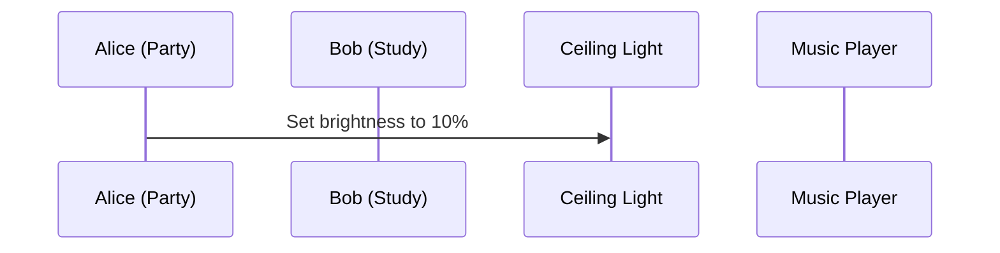

<p style={{fontSize: '0.85em'}}>
Alice sets the lights to 10%. So far so good...
</p>

<aside className="notes">
**Pause here.** "Nothing wrong yet. Alice sets lights to 10%. What happens if Bob arrives right now?"
</aside>

</Slide>

<Slide>

## The Interleaving (2/3): Bob Overwrites Alice
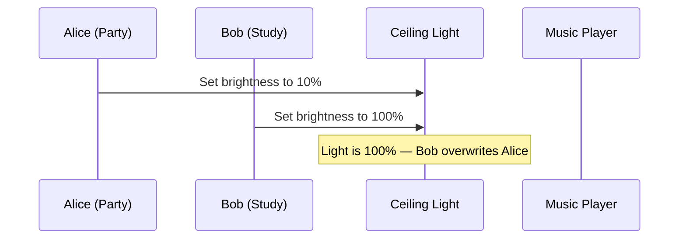

<p style={{fontSize: '0.85em', color: '#e06c75'}}>
Bob overwrites Alice's light setting. The lights are now 100% — Study mode wins on lights.
</p>

<aside className="notes">
**This is the key moment.** Bob's write simply overwrites Alice's. "And the same thing is about to happen with the music..."
</aside>

</Slide>

<Slide>

## The Interleaving (3/3): Nobody Got What They Wanted
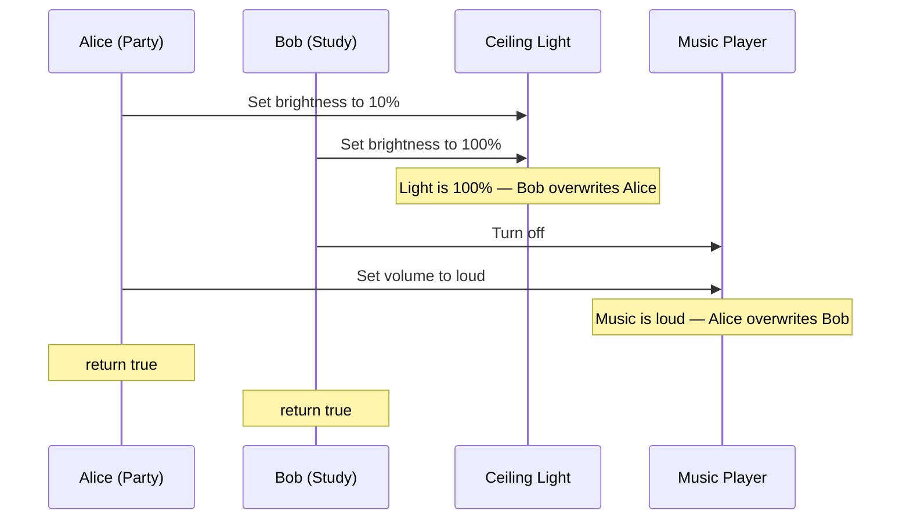

<p style={{fontSize: '0.8em', color: '#e06c75', marginTop: '0.3em'}}>
Light = 100% (Study). Music = loud (Party). Both got <code>true</code>. <strong>Neither scene actually applied.</strong>
</p>

<aside className="notes">
**The scary part:** Both methods return `true`. No exception. No crash. The room is silently in a mixed state — Study-mode lighting with Party-mode music. Alice and Bob each think their scene is active. Neither is correct.

**Key question to ask:** "How would you even know this happened? No error was thrown. The only way to discover it is to walk into the room."

> **Transition:** This has a name...
</aside>

</Slide>

<Slide>

## Race Conditions: When Correctness Depends on Luck

<div style={{fontSize: '0.8em'}}>

A **race condition** occurs when the program's behavior depends on the relative timing of operations,
which is unpredictable. The core issue: operations (such as activating a scene) that should be **atomic**
(all or nothing) are actually multiple steps that can be interleaved.

</div>

<div style={{fontSize: '0.75em'}}>

Common patterns:

| Pattern | Example | Why it's dangerous |
|---------|---------|-------------------|
| **Check-then-act** | `if (!scenes.containsKey(name)) scenes.put(name, scene)` | Another thread puts first |
| **Read-modify-write** | `deviceCount++` | Two threads read same value |
| **Compound action** | Read state + write new state across multiple devices | Interleaving between reads and writes |

</div>

<p style={{fontSize: '0.85em', marginTop: '0.8em', color: '#e06c75'}}>
These bugs are timing-dependent — your tests pass 99 times, fail once, and you can't reproduce it.
</p>

<aside className="notes">
**Why race conditions are terrifying:**
- They don't throw exceptions
- They don't crash the program
- They produce silently wrong results
- They depend on timing, so they might never appear in testing
- They appear in production under load, when timing changes

**The check-then-act pattern** is extremely common. Students will write `if (!map.containsKey(key)) map.put(key, value)` and think it's safe. It's not — another thread can insert between the check and the put.

> **Transition:** Let's look at the simplest possible race condition...
</aside>

</Slide>

<Slide>

## You Can't Even Trust deviceCount++ (1/2)

<p style={{fontSize: '0.85em'}}>
<code>deviceCount++</code> is <strong>three operations</strong>: read, add, write. Two threads registering devices simultaneously:
</p>

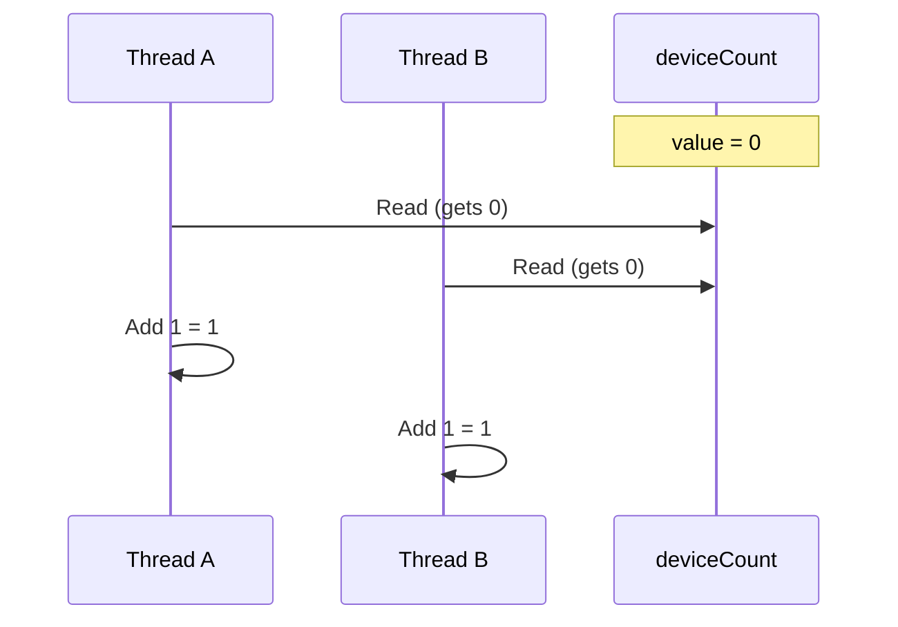

<p style={{fontSize: '0.85em'}}>
Both threads read 0. Both compute 1. What happens when they write?
</p>

<aside className="notes">
**Pause here.** "Both threads read the same value — 0. Both independently add 1. What value does each one write?" Students will say "1." "And what should the final value be?" "2." "But both are about to write 1..."
</aside>

</Slide>

<Slide>

## You Can't Even Trust deviceCount++ (2/2)

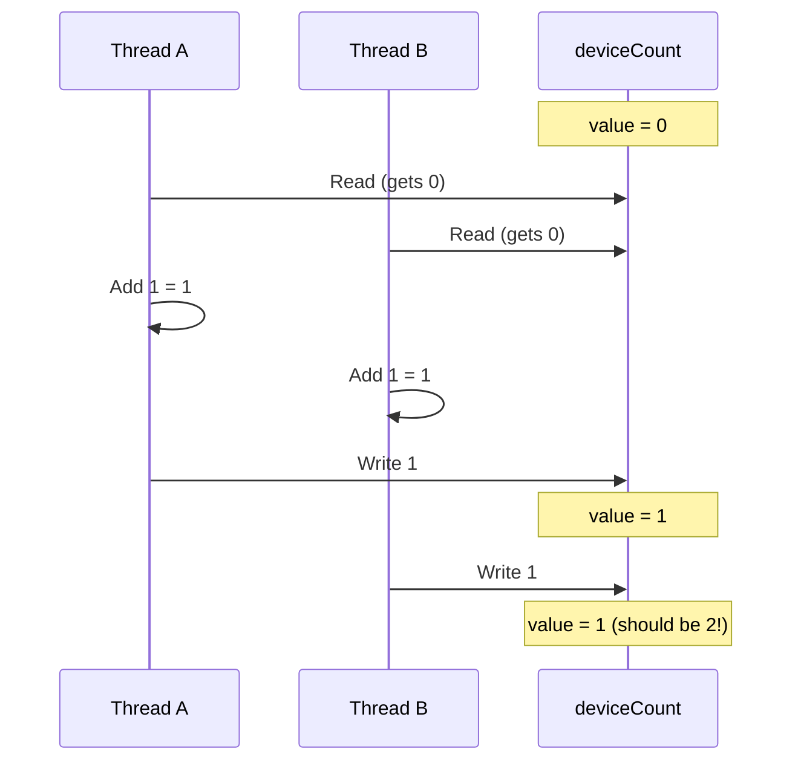

<p style={{fontSize: '0.8em', color: '#e06c75', marginTop: '0.3em'}}>
<strong>Lost update:</strong> Thread A writes 1. Thread B writes 1 — overwrites A's result with the same stale computation. One increment is silently lost. If you can't trust <code>deviceCount++</code>, how do you trust anything?
</p>

<aside className="notes">
**This is the "aha" moment.** Students think `deviceCount++` is a single operation because it's a single line of code. It's not — the JVM compiles it into read, add, write. Two threads can interleave between any of those steps.

**Expected result:** 2 (two devices registered). **Actual result:** 1 (one registration lost). No error, no exception — just silently wrong.

> **Transition:** And it gets worse...
</aside>

</Slide>

<Slide>

## The Java Memory Model: It Gets Worse


<aside className="notes">
**This is counterintuitive.** Students expect that if Thread A writes `brightness = 30`, Thread B will eventually see 30. But the JVM and CPU are allowed to cache writes, reorder instructions, and delay flushing to main memory — all for performance.

**Spend time on the diagram.** Core 1 has the updated values in its cache. Core 2's cache is stale. Main memory might or might not be updated yet — the JVM doesn't guarantee when writes flush. This is a real hardware effect, not a JVM quirk.

> **Transition:** Let's see what this looks like in code...
</aside>

</Slide>

<Slide>

## Visibility in Code

<div style={{fontSize: '0.72em'}}>

```java
public class DeviceStateHolder {
    private boolean ready = false;
    private int brightness = 0;

    // Thread A (scene activation worker) writes:
    public void updateBrightness() {
        brightness = 30;
        ready = true;
    }

    // Thread B (UI refresh worker) reads:
    public void checkBrightness() {
        while (!ready) { /* spin-wait */ }
        System.out.println(brightness);  // Might print 0!
    }
}
```

</div>

<div style={{fontSize: '0.8em'}}>

**Three things that can go wrong without synchronization:**
1. Thread B **never sees** `ready = true` — spins forever (write cached, never flushed)
2. Thread B sees `ready = true` but `brightness = 0` — **writes reordered** by the CPU
3. Thread B sees both correctly — works today, **breaks tomorrow** on different hardware

</div>

<p style={{fontSize: '0.8em', color: '#9370DB'}}>
The fix: <code>synchronized</code>, <code>volatile</code>, or atomic classes — all establish a "happens-before" relationship that guarantees visibility.
</p>

<aside className="notes">
**All three outcomes are legal** under the Java Memory Model without synchronization. The JVM is free to reorder writes and delay cache flushes for performance. This is why "it works on my machine" is so dangerous with concurrency — different hardware has different cache behavior.

**Option 3 is the scariest** — the code appears to work during development and testing, then breaks in production on a machine with a different CPU architecture or more cores.

> **Transition:** So how do we fix all of this?
</aside>

</Slide>

{/* ============================================ */}
{/* ARC 4: SOLVING IT — SYNCHRONIZATION (~12 min) */}
{/* ============================================ */}

<Slide>

## synchronized: One Scene at a Time

<div style={{display: 'grid', gridTemplateColumns: '1fr 1.2fr', gap: '0.5em'}}>

<div style={{fontSize: '0.62em'}}>

```java
public class SceneService {
    public synchronized boolean
        activateScene(
            Scene scene, Area room) {
        // Only one thread at a time
        for (Device d : room.getDevices()) {
            DeviceState target =
                scene.getTargetState(d);
            if (target != null) {
                d.setState(target);
            }
        }
        return true;
    }
}
```

</div>

<div>

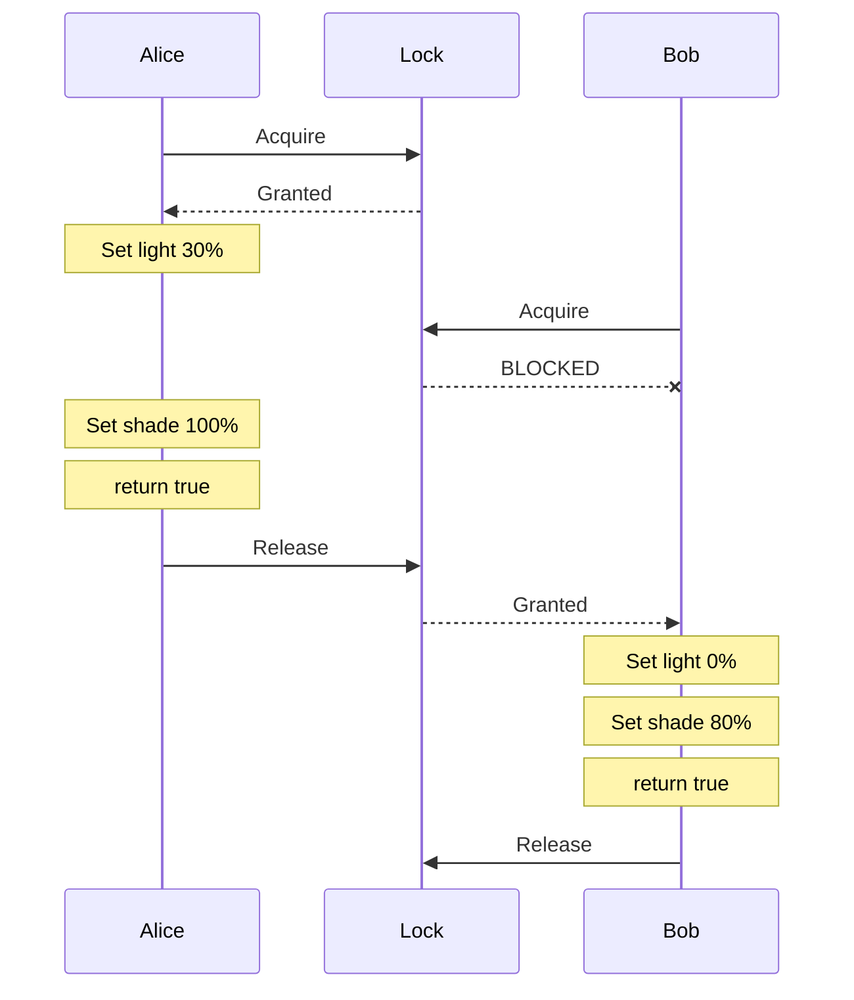

</div>

</div>

<p style={{fontSize: '0.85em', marginTop: '0.3em'}}>
Now the scene activation is <strong>atomic</strong>. The room goes "Evening" then "Movie Night", never a mix.
</p>

<aside className="notes">
**This is the fix for slide 9's bug.** Adding `synchronized` to the method means the JVM acquires a lock (monitor) on the `SceneService` instance before entering the method. If another thread already holds the lock, the caller blocks until it's released.

**Bob's thread waits.** It doesn't crash, doesn't get an exception — it simply waits until Alice's scene finishes applying. Then Bob's scene applies cleanly. The room transitions from "Evening" to "Movie Night" in sequence, never a mix.

> **Transition:** What exactly does synchronized guarantee?
</aside>

</Slide>

<Slide>

## What synchronized Actually Does

<div style={{fontSize: '0.8em'}}>

`synchronized` provides **two guarantees:**

</div>

<div style={{display: 'grid', gridTemplateColumns: '1fr 1fr', gap: '1.5em', fontSize: '0.8em'}}>

<div style={{backgroundColor: 'rgba(100,149,237,0.15)', padding: '0.8em', borderRadius: '8px'}}>

**1. Mutual Exclusion**

Only one thread can execute the synchronized block at a time. Bob's scene activation waits until Alice's finishes.

Fixes the **race condition** from slide 9.

</div>

<div style={{backgroundColor: 'rgba(50,205,50,0.15)', padding: '0.8em', borderRadius: '8px'}}>

**2. Visibility**

When a thread releases a lock, all its writes are flushed to main memory. When another thread acquires the same lock, it sees all those writes.

Fixes the **memory visibility** problem from slide 12.

</div>

</div>

<p style={{fontSize: '0.85em', marginTop: '1em'}}>
<code>synchronized</code> fixes <em>both</em> the interleaving problem and the caching problem. That's why it's the fundamental building block.
</p>

<aside className="notes">
**Two bugs, one fix.** Students often think `synchronized` is only about mutual exclusion. The visibility guarantee is equally important — it's what ensures Thread B sees Thread A's brightness changes after acquiring the lock.

**The "happens-before" relationship:** Releasing a lock "happens-before" acquiring the same lock. This means all writes before the release are visible after the acquire. This is formalized in the Java Language Specification.

> **Transition:** But locking the whole service is too coarse...
</aside>

</Slide>

<Slide>

## Fine-Grained Locking: Don't Lock the Whole House

<div style={{fontSize: '0.72em'}}>

```java
public class SceneService {
    // One lock per room — different rooms can be controlled in parallel
    private final Map<String, Object> roomLocks = new ConcurrentHashMap<>();

    public boolean activateScene(Scene scene, Area room) {
        Object roomLock = roomLocks.computeIfAbsent(
            room.getId(), k -> new Object()
        );
        synchronized (roomLock) {
            for (Device device : room.getDevices()) {
                DeviceState targetState = scene.getTargetState(device);
                if (targetState != null) {
                    device.setState(targetState);
                }
            }
            return true;
        }
    }
}
```

</div>

<p style={{fontSize: '0.85em', marginTop: '0.5em'}}>
Alice activates "Evening" in the <strong>living room</strong>, Bob activates "Movie Night" in the <strong>bedroom</strong> — both proceed in parallel because they lock <strong>different rooms</strong>.
</p>

<p style={{fontSize: '0.8em', color: '#9370DB'}}>
Use dedicated lock objects: <code>synchronized(roomLock)</code> not <code>synchronized(this)</code>.
</p>

<aside className="notes">
**Why fine-grained?** With `synchronized` on the whole method, Alice's living room scene blocks Bob's bedroom scene — even though they don't share any devices. Fine-grained locking (one lock per room) lets independent operations proceed in parallel.

**Dedicated lock objects:** Using `synchronized(this)` exposes the lock to external code — anyone with a reference to the object can synchronize on it, potentially causing unexpected blocking. A private lock object keeps locking internal.

**Tradeoff:** More locks = more parallelism but more complexity. Fewer locks = simpler but less parallelism. For SceneItAll, per-room locking is a good balance.

> **Transition:** Java also provides ready-made thread-safe collections...
</aside>

</Slide>

<Slide>

## Concurrent Collections and AtomicInteger

<div style={{fontSize: '0.72em'}}>

```java
public class DeviceRegistry {
    // Thread-safe map — no external synchronization needed
    private final ConcurrentHashMap<String, Device> devices =
        new ConcurrentHashMap<>();

    // Thread-safe counter — fixes the deviceCount++ bug
    private final AtomicInteger deviceCount = new AtomicInteger(0);

    public void registerDevice(Device device) {
        // putIfAbsent: atomic check-and-put in one operation
        Device existing = devices.putIfAbsent(device.getId(), device);
        if (existing == null) {
            deviceCount.incrementAndGet();  // Atomic increment
        }
    }

    public int getDeviceCount() {
        return deviceCount.get();
    }
}
```

</div>

<div style={{fontSize: '0.75em', marginTop: '0.5em'}}>

| Collection | Use case |
|-----------|----------|
| `ConcurrentHashMap` | Device registry — many readers, occasional writers |
| `AtomicInteger` | Counters — `deviceCount`, `commandsSent` |
| `BlockingQueue` | Command queue — producers (users) and consumers (workers) |
| `CopyOnWriteArrayList` | Listener lists — read-heavy, rarely modified |

</div>

<p style={{fontSize: '0.8em', color: '#9370DB', marginTop: '0.3em'}}>
Use these — the experts already debugged them.
</p>

<aside className="notes">
**This fixes the slide 11 bug.** `AtomicInteger.incrementAndGet()` uses hardware-level compare-and-swap (CAS) to atomically read, add, and write. No lock needed, no lost updates.

**`putIfAbsent`** is the atomic version of the check-then-act pattern: `if (!map.containsKey(key)) map.put(key, value)`. One atomic operation instead of two separate ones.

**Full imports:**
```java
import java.util.concurrent.ConcurrentHashMap;
import java.util.concurrent.atomic.AtomicInteger;
import java.util.concurrent.BlockingQueue;
import java.util.concurrent.CopyOnWriteArrayList;
```

**Design principle:** Don't roll your own thread-safe data structures. Use `java.util.concurrent`. Doug Lea and team spent years getting these right.

> **Transition:** Synchronization solves race conditions, but it introduces a new problem...
</aside>

</Slide>

{/* ============================================ */}
{/* ARC 5: DEADLOCK (~8 min) */}
{/* ============================================ */}

<Slide>

## Deadlock: When Everyone Waits Forever (1/2)

<p style={{fontSize: '0.85em'}}>
Two methods, opposite lock ordering. What happens when they run simultaneously?
</p>

<div style={{fontSize: '0.72em'}}>

```java
public class SmartHomeService {
    public void activateScene(Scene scene, Area room) {
        synchronized (room) {                    // Lock room FIRST
            for (Device device : room.getDevices()) {
                synchronized (device) {          // Then lock device
                    device.setState(scene.getTargetState(device));
                }
            }
        }
    }

    public void firmwareUpdate(Device device, Area room,
                                FirmwarePackage firmware) {
        synchronized (device) {                  // Lock device FIRST
            synchronized (room) {                // Then lock room
                device.applyFirmware(firmware);
                room.updateDeviceManifest(device);
            }
        }
    }
}
```

</div>

<aside className="notes">
**Point out the lock ordering.** `activateScene` goes room → device. `firmwareUpdate` goes device → room. Ask students: "What happens if both run at the same time?"

Let them think. Some will see it. Then advance to the next slide.
</aside>

</Slide>

<Slide>

## Deadlock: When Everyone Waits Forever (2/2)

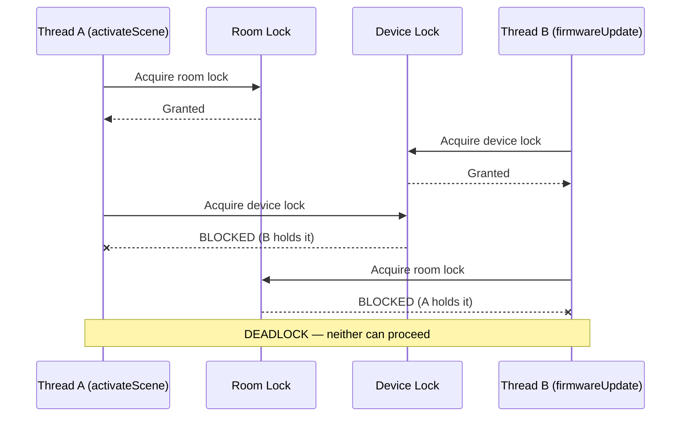

<p style={{fontSize: '0.85em', color: '#e06c75'}}>
Both threads are stuck. The living room lights are frozen at 100%. <strong>Forever.</strong> Unlike a race condition (wrong results), deadlock produces <strong>no results</strong>. No error. No exception. The system just hangs.
</p>

<aside className="notes">
**Walk through the diagram step by step:**
1. Thread A gets the room lock. Fine.
2. Thread B gets the device lock. Also fine.
3. Thread A tries to get the device lock — blocked, B has it.
4. Thread B tries to get the room lock — blocked, A has it.
5. Neither can release what they hold because they're both stuck waiting.

**"Forever" is literal.** The user taps "activate scene" and nothing happens. No error message. No log entry. Just silence. That's worse than a crash — at least a crash tells you something went wrong.

> **Transition:** How do we prevent this?
</aside>

</Slide>

<Slide>

## Preventing Deadlock: Break the Cycle

<p style={{fontSize: '0.85em'}}>
Deadlock happens because of a <strong>circular wait</strong>: Thread A holds lock X and waits for lock Y, while Thread B holds lock Y and waits for lock X. Neither can proceed.
</p>

<p style={{fontSize: '0.85em'}}>
The simplest fix: <strong>always acquire locks in the same order.</strong>
</p>

<div style={{display: 'grid', gridTemplateColumns: '1fr 1fr', gap: '1em', fontSize: '0.68em'}}>

<div style={{backgroundColor: 'rgba(200,74,74,0.15)', padding: '0.8em', borderRadius: '8px'}}>

**Before (deadlock possible)**

```java
// activateScene: room → device
synchronized (room) {
    synchronized (device) { ... }
}

// firmwareUpdate: device → room
synchronized (device) {
    synchronized (room) { ... }
}
```

Different order → circular wait → deadlock

</div>

<div style={{backgroundColor: 'rgba(50,205,50,0.15)', padding: '0.8em', borderRadius: '8px'}}>

**After (deadlock impossible)**

```java
// activateScene: room → device
synchronized (room) {
    synchronized (device) { ... }
}

// firmwareUpdate: room → device
synchronized (room) {
    synchronized (device) { ... }
}
```

Same order → no cycle → no deadlock

</div>

</div>

<aside className="notes">
**Consistent lock ordering is a convention, not a mechanism.** The language doesn't enforce it — you enforce it through code review and documentation. "In this codebase, we always lock rooms before devices." Simple rule, prevents an entire class of bugs.

**If students ask about other approaches:** You can also use `tryLock()` with a timeout (back off if you can't get the lock), or reduce lock scope (release one lock before acquiring another). But consistent ordering is the go-to strategy — it's the simplest and most reliable.

> **Transition:** Let's check your understanding...
</aside>

</Slide>

{/* ============================================ */}
{/* ARC 6: WRAP-UP (~5 min) */}
{/* ============================================ */}

<Slide>

## Comprehension Check

<p style={{fontSize: '0.85em'}}>
Open Poll Everywhere and answer the three questions.
</p>

<aside className="notes">
**Poll Q1:** Two users activate different scenes simultaneously on the same room. `activateScene()` is not synchronized. What can happen?
- A. One scene applies cleanly, the other is rejected
- B. Devices end up in a mixed state — some from one scene, some from the other [CORRECT]
- C. ConcurrentModificationException
- D. The hub crashes

*Discussion: B is the scary answer. There's no exception, no crash — just silently wrong device states. That's what makes race conditions dangerous.*

**Poll Q2:** Thread A is executing `synchronized(livingRoomLock) { ... }`. Thread B tries to execute `synchronized(livingRoomLock) { ... }` on the same lock. Thread C tries to execute `synchronized(bedroomLock) { ... }`. What happens?
- A. B and C both block until A finishes
- B. B blocks; C executes immediately (different lock) [CORRECT]
- C. All three execute — synchronized doesn't actually block
- D. B throws an exception

*Discussion: This is the fine-grained locking payoff. Different rooms use different locks, so they can be controlled in parallel.*

**Poll Q3:** `activateScene()` locks room then device. `firmwareUpdate()` locks device then room. Which prevents deadlock?
- A. Both always lock room first, then device [CORRECT]
- B. Remove synchronized from both methods
- C. Use one global lock for the entire hub [Works but kills parallelism]
- D. Both A and C prevent deadlock, but A is better [CORRECT]

*Discussion: D is the most complete answer. A single global lock prevents deadlock but serializes everything — no parallelism between rooms. Consistent ordering (A) preserves fine-grained parallelism while preventing deadlock.*
</aside>

</Slide>

<Slide>

## Concurrency Bugs Are the Hardest Bugs

<div style={{fontSize: '0.8em'}}>

Why they're hard:

- **Timing-dependent** — the bug only appears under specific interleavings
- **Non-reproducible** — run the same test twice, get different results
- **Load-dependent** — works fine with 5 devices, glitches with 50

</div>

<p style={{fontSize: '0.85em', marginTop: '0.8em'}}>
The family's lights work fine with 5 devices. Add a 6th and scenes start glitching. Add a firmware update and the hub deadlocks. These bugs grow with scale.
</p>

<div style={{fontSize: '0.8em', marginTop: '0.8em'}}>

**Detection strategies:**
1. **Code review** — look for shared mutable state accessed without synchronization
2. **Static analysis** — tools like SpotBugs detect common patterns
3. **Stress testing** — activate 10 scenes simultaneously, verify device states
4. **Design** — prefer immutable objects, concurrent collections, minimal shared state

</div>

<p style={{fontSize: '0.85em', color: '#9370DB', marginTop: '0.5em'}}>
"The best concurrency bug is the one you avoid by not sharing mutable state."
</p>

<aside className="notes">
**This is a mindset slide.** The takeaway isn't "memorize these four strategies" — it's "concurrency bugs are qualitatively different from the bugs you've encountered so far."

**Normal bugs** are deterministic — same input, same output, every time. You can set a breakpoint and step through.

**Concurrency bugs** are nondeterministic — they depend on scheduling, CPU speed, cache behavior, load, and phase of the moon. Your test might pass 999 times and fail once. Adding a print statement changes the timing enough to make the bug disappear (a "Heisenbug").

**The best defense is design:** don't share mutable state in the first place. Use immutable records, concurrent collections, and message passing. When you must share state, use synchronization.

> **Transition:** Key takeaways...
</aside>

</Slide>

<Slide>

## Key Takeaways

<ol style={{fontSize: '0.8em'}}>
  <li><strong>Threads enable concurrency</strong> — multiple paths of execution sharing the same heap. Use thread pools, not raw threads.</li>
  <li><strong>Shared mutable state is dangerous.</strong> Race conditions produce silently wrong results. <code>deviceCount++</code> is not atomic.</li>
  <li><strong><code>synchronized</code> provides atomicity + visibility.</strong> Mutual exclusion prevents interleaving. Memory visibility ensures threads see each other's writes.</li>
  <li><strong>Use concurrent collections</strong> — <code>ConcurrentHashMap</code>, <code>AtomicInteger</code>, <code>BlockingQueue</code>. The experts already debugged them.</li>
  <li><strong>Fine-grained locking increases parallelism</strong> — lock per room, not per hub. But more locks = more deadlock risk.</li>
  <li><strong>Prevent deadlock with consistent lock ordering.</strong> Always acquire locks in the same order across all code paths.</li>
</ol>

<aside className="notes">
**Recap the arc:** We started with the motivating problem (50 devices, 3 users, 1 hub). We learned how threads work (creating, pooling, interrupting). We saw what goes wrong (race conditions, lost updates, stale data). We fixed it (synchronized, concurrent collections). And we saw the new problem synchronization creates (deadlock).

**Connection to GA1:** Students won't write raw thread code in GA1 — they'll use `BackgroundTaskRunner`. But they need to understand what it does internally, and they need to recognize when shared state is being accessed concurrently.

> **Transition:** What's coming next...
</aside>

</Slide>

<Slide>

## Looking Ahead

<div style={{fontSize: '0.85em'}}>

**L32 (Wednesday): Asynchronous Programming**
- Activating "Evening" means sending commands to 15 devices — each one a 200ms network call
- Threads are expensive for all that waiting
- `CompletableFuture` and `allOf` for fan-out patterns
- `Platform.runLater()` for updating your GA1 GUI from a background thread

**Lab 12 runs Monday** — GUI pair programming with Scene Builder

**Your group project:**
- GA1 (due Apr 9): `BackgroundTaskRunner` wraps the threading concepts from today
- Your TA will ask what happens under the hood — be ready to explain threads, shared state, and synchronization

</div>

<p style={{fontSize: '0.85em', marginTop: '1em', color: '#9370DB'}}>
Today: why shared state is dangerous and how locks protect it. Wednesday: how to avoid blocking threads entirely.
</p>

<aside className="notes">
**L32 preview:** Today we learned that threads can run work concurrently. But sending 15 device commands means 15 threads sitting around waiting for Zigbee responses. Each thread costs memory. L32 introduces async programming — instead of blocking a thread waiting for a response, you register a callback and move on. CompletableFuture makes this composable.

**Lab 12:** Students build SceneItAll GUI components using Scene Builder and MVVM patterns from L29-30. This is pair programming — they'll practice binding, property listeners, and FXML layout.

**GA1 connection:** `BackgroundTaskRunner.run(callable, onSuccess, onFailure)` is the practical tool. Under the hood: it creates a `javafx.concurrent.Task`, runs it on a daemon thread, and uses `Platform.runLater()` to call `onSuccess`/`onFailure` on the FX thread. Students need to explain this during code walks.

> That's it for today. Questions?
</aside>

</Slide>

</RevealJS>
