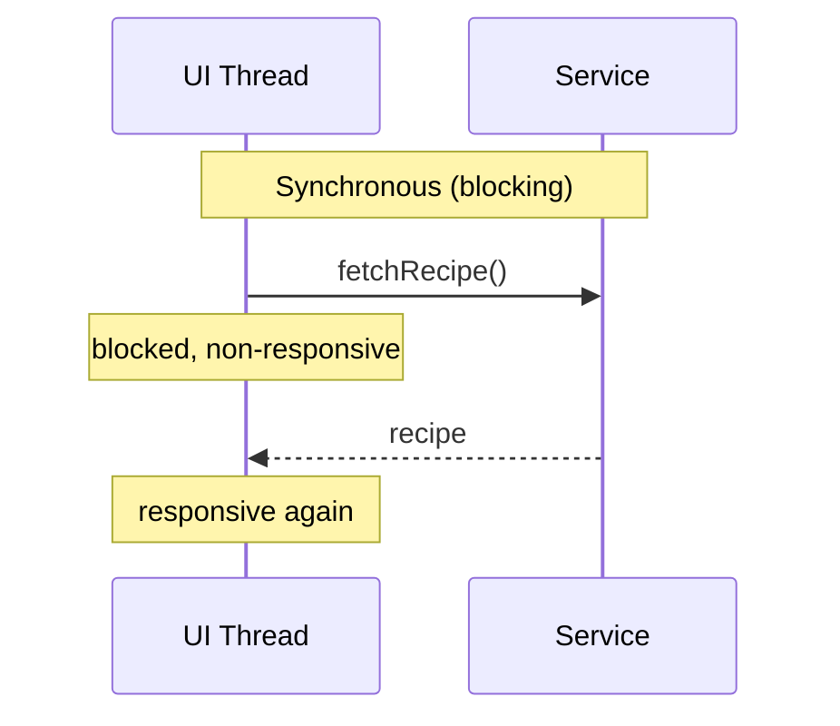
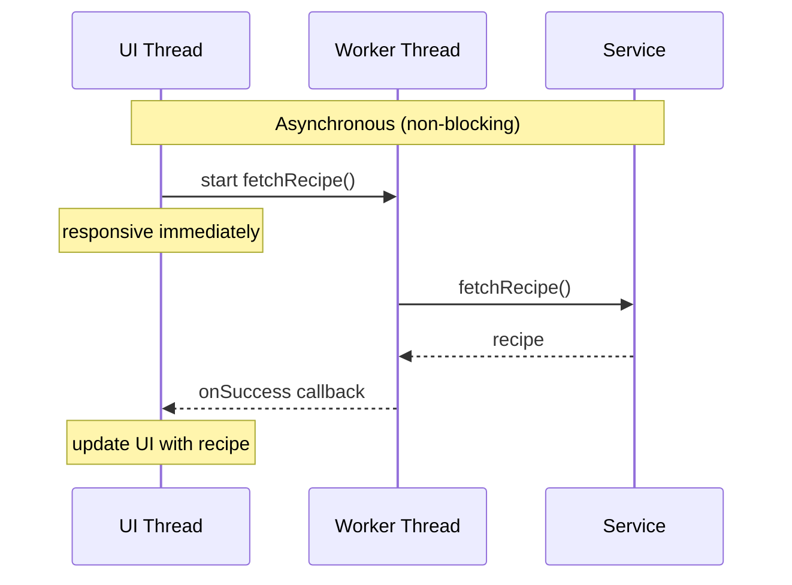

import RevealJS, { Slide } from '@site/src/components/RevealJS';
import Img from '@site/src/components/Img';
import PollSlide from '@site/src/components/PollSlide';

<RevealJS transition="slide">

{/* ============================================ */}
{/* COVER IMAGE */}
{/* ============================================ */}

<Slide>
  

<aside className="notes">
**Lecture overview:**
- **Total time:** ~55 minutes
- **Prerequisites:** L31 (Threads, Synchronization, Deadlock), L29/L30 (JavaFX, MVVM, event loop)
- **Connects to:** L33 (Event-Driven Architecture), GA1 (BackgroundTaskRunner, Platform.runLater)

**Structure (~27 slides):**
- Arc 0: L31 Bridge (~3 min)
- Arc 1: The Problem with Threads for I/O (~8 min)
- Arc 2: The Async Model + Restaurant Analogy (~10 min)
- Arc 3: Futures and CompletableFuture (~18 min) — progressive reveal pipeline
- Arc 4: Async Safety (~12 min) — ordering bugs, thread confinement, Platform.runLater
- Arc 5: Wrap-up (~5 min)

**Running example:** SceneItAll — activating "Evening" scene sends commands to 15 devices.

> **Transition:** Let's start with the learning objectives...
</aside>

</Slide>

<Slide>

## Learning Objectives

<p style={{fontSize: '0.85em', textAlign: 'left'}}>
After this lecture, you will be able to:
</p>

<ol style={{fontSize: '0.75em', textAlign: 'left'}}>
  <li>Distinguish blocking from non-blocking operations and explain how blocking affects threads</li>
  <li>Explain how <code>BackgroundTaskRunner</code> separates I/O from UI updates across threads</li>
  <li><span>Identify and avoid common async safety pitfalls:</span><span style={{display:'block'}}>&nbsp;&nbsp;— Debounce race conditions</span><span style={{display:'block'}}>&nbsp;&nbsp;— Timer thread mistakes</span><span style={{display:'block'}}>&nbsp;&nbsp;— Task cancellation behavior</span></li>
</ol>

<aside className="notes">
**Time allocation:**
- Objective 1: The threading rule + blocking/non-blocking (~15 min)
- Objective 2: BackgroundTaskRunner internals (~10 min)
- Objective 3: Async safety pitfalls — debounce race condition, PauseTransition, task cancellation (~18 min)
- Wrap-up: comprehension check, key takeaways (~7 min)

→ Let's look at the big picture
</aside>

</Slide>

<Slide>

## Big Picture

<div style={{ fontSize: '.8em' }}>
GUI apps need to stay responsive while doing slow work. The naive fix — spawning a thread — works but has costs.

Today you'll learn a cleaner approach you'll use directly in Lab 13 and GA1.

</div>

<aside className="notes">

</aside>

</Slide>

{/* ============================================ */}
{/* ARC 1: FROM THREAD TO BACKGROUNDTASKRUNNER */}
{/* ============================================ */}
<Slide>

## Cook My Books Example A

<div style={{display: 'flex', gap: '1.5rem', alignItems: 'flex-start'}}>
<div style={{flex: '0 0 45%'}}>
```java
public class CookMyBooks {
  private static final long START_TIME = System.currentTimeMillis();

  private static void log(String message) {
    long elapsed = System.currentTimeMillis() - START_TIME;
    String thread = Thread.currentThread().getName();
    System.out.printf("%4dms %s %s%n", elapsed, thread, message);
  }

  private static String fetchRecipe() {
    log("Fetching recipe...");
    try {
      Thread.sleep(2000); // simulates slow network call
    } catch (InterruptedException e) {
      // this can't happen in our program
    }
    log("Got recipe!");
    return "Cookie Recipe";
  }

  private static void updateUI(String recipe) {
    log("Updating UI: " + recipe);
  }

  // This runs in the UI thread.
  private static void handleFetchRecipeRequest() {
    log("UI thread received fetch recipe request");
    log("UI is non-responsive");
    String recipe = fetchRecipe();
    updateUI(recipe);
    log("UI is now responsive again");
  }

  public static void main(String[] args) {
    handleFetchRecipeRequest();
  }
}
```

</div>
<div className='fragment' style={{flex: '0 0 50%', fontSize: '0.8em'}}>
<pre>
<span style={{color: '#4ac'}}>    0ms main UI thread received fetch recipe request</span><br/>
<span style={{color: '#4ac'}}>   20ms main UI is non-responsive</span><br/>
<span style={{color: '#4ac'}}>   21ms main Fetching recipe...</span><br/>
<span style={{color: '#4ac'}}> 2036ms main Got recipe!</span><br/>
<span style={{color: '#4ac'}}> 2038ms main Updating UI: Cookie Recipe</span><br/>
<span style={{color: '#4ac'}}> 2038ms main UI is now responsive again</span>
</pre>
</div>
</div>

<div style={{ fontSize: '.6em' }}>
https://github.com/cs3100-spertus-s26/concurrency-examples/blob/cmb-a/app/src/main/java/concurrency/CookMyBooks.java
</div>

<aside className="notes">
**Key point:** The UI thread is blocked for 2 seconds — during this time, no user interaction can be processed. In a real GUI, the window would freeze.

> **Transition:** So what's the fix?
</aside>

</Slide>

<Slide>

## Cook My Books Example B

<div style={{display: 'flex', gap: '1.5rem', alignItems: 'flex-start'}}>
<div style={{flex: '0 0 45%'}}>
```java
public class CookMyBooks {
  private static final long START_TIME = System.currentTimeMillis();

  private static void log(String message) { .. }

  private static String fetchRecipe() {
    log("Fetching recipe...");
    try {
      Thread.sleep(2000); // simulates slow network call
    } catch (InterruptedException e) { .. }
    log("Got recipe!");
    return "Cookie Recipe";
  }

  private static void updateUI(String recipe) {
    log("Updating UI: " + recipe);
  }

  // This runs in the UI thread
  private static void handleFetchRecipeRequest() {
    log("UI thread received fetch recipe request");
    log("UI is non-responsive");

    // Create a worker thread to fetch the recipe
    new Thread(CookMyBooks::fetchRecipe).start();
    log("UI is now responsive again");
    // How do we update the UI with the recipe?
  }

  public static void main(String[] args) {
    handleFetchRecipeRequest();
  }
}
```

</div>
<div className='fragment' style={{flex: '0 0 50%', fontSize: '0.65em'}}>
<pre>
<span style={{color: '#4ac'}}>    0ms main UI thread received fetch recipe request</span><br/>
<span style={{color: '#4ac'}}>   23ms main UI is non-responsive</span><br/>
<span style={{color: '#4ac'}}>   24ms main UI is now responsive again</span><br/>
<span style={{color: '#e06c75'}}>   24ms Thread-0 Fetching recipe...</span><br/>
<span style={{color: '#e06c75'}}> 2035ms Thread-0 Got recipe!</span>
</pre>

<div style={{marginTop: '0.8em'}}>

✅ UI remains responsive

❌ How does UI get updated with recipe?

</div>
</div>
</div>

<div style={{ fontSize: '.6em' }}>
https://github.com/cs3100-spertus-s26/concurrency-examples/blob/cmb-b/app/src/main/java/concurrency/CookMyBooks.java
</div>

<aside className="notes">
**Key point:** The UI thread is now responsive, but we've lost the ability to hand the recipe back to the UI. The worker thread has the return value but no way to pass it back safely.

> **Transition:** BackgroundTaskRunner solves this — it runs the callable on a background thread and delivers the result back to the FX thread via the success callback.
</aside>

</Slide>

<Slide>

## Cook My Books Example C

<div style={{display: 'flex', gap: '1.5rem', alignItems: 'flex-start'}}>
<div style={{flex: '0 0 45%'}}>
```java
public class CookMyBooks {
  // ... log() unchanged

  private static void fetchRecipe() {
    log("Fetching recipe...");
    try {
      Thread.sleep(2000); // simulates slow network call
    } catch (InterruptedException e) {
      // this can't happen in our program
    }
    log("Got recipe!");
    updateUI("Cookie Recipe");
  }

  private static void updateUI(String recipe) {
    if (!Thread.currentThread().getName().equals("main")) {
      throw new IllegalStateException(
        "updateUI must be called on the main thread");
    }
    log("Updating UI: " + recipe);
  }

  // This runs in the UI thread.
  private static void handleFetchRecipeRequest() {
    log("UI thread received fetch recipe request");
    log("UI is non-responsive");
    new Thread(CookMyBooks::fetchRecipe).start();
    log("UI is now responsive again");
  }

  public static void main(String[] args) {
    handleFetchRecipeRequest();
  }
}
```

</div>
<div className='fragment' style={{flex: '0 0 50%', fontSize: '0.65em'}}>
<pre>
<span style={{color: '#4ac'}}>    0ms main UI thread received fetch recipe request</span><br/>
<span style={{color: '#4ac'}}>   16ms main UI is non-responsive</span><br/>
<span style={{color: '#4ac'}}>   19ms main UI is now responsive again</span><br/>
<span style={{color: '#e06c75'}}>   19ms Thread-0 Fetching recipe...</span><br/>
<span style={{color: '#e06c75'}}>Exception in thread "Thread-0" java.lang.IllegalStateException: <br/>updateUI must be called on the main thread</span><br/>
<span style={{color: '#e06c75'}}>2029ms Thread-0 Got recipe!</span><br/>
</pre>


</div>
</div>

<div style={{ fontSize: '.6em' }}>
https://github.com/cs3100-spertus-s26/concurrency-examples/blob/cmb-c/app/src/main/java/concurrency/CookMyBooks.java
</div>

<aside className="notes">
**Key point:** The worker thread calls updateUI() directly, which throws because UI updates must happen on the main/FX thread. In a real JavaFX app, modifying an ObservableList or Property from a background thread throws a similar exception.

**Note:** The exception prints before "Got recipe!" because the exception is thrown inside updateUI(), which is called before the final log() in fetchRecipe().

> **Transition:** So how do we get the result back to the UI thread? That's what BackgroundTaskRunner solves...
</aside>

</Slide>

<Slide>

## Asynchronous Programming

<div style={{fontSize: '0.8em', marginBottom: '0.8em'}}>
<strong>Asynchronous:</strong> start an operation and move on; get notified when it completes.
</div>

<div style={{display: 'flex', gap: '2rem', alignItems: 'flex-start'}}>

<div style={{flex: '0 0 45%'}}>

<div style={{ fontSize: '.7em' }}>
Original single-threaded synchronous version
</div>
</div>

<div style={{flex: '0 0 45%'}}>


</div>

</div>

<aside className="notes">
**Key point:** In the synchronous model, the UI thread is stuck waiting. In the async model, the UI thread hands off the work and stays free. The callback is the mechanism by which the result comes back to the UI thread.

**Connection to BackgroundTaskRunner:** This is exactly what BackgroundTaskRunner implements — the callable runs on the worker thread, and onSuccess is delivered back to the FX thread.

> **Transition:** Let's see how BackgroundTaskRunner implements this...
</aside>

</Slide>

<Slide>

## Asynchronous Programming: The Pattern

<div style={{fontSize: '0.8em', marginBottom: '0.8em'}}>
To run a task asynchronously, you need to specify:
</div>

<ol style={{fontSize: '0.8em'}}>
  <li>What task to run in the background</li>
  <li>What to do on success</li>
  <li>What to do on failure</li>
</ol>

<div style={{fontSize: '0.7em', marginTop: '0.8em'}} className='fragment'>

| | Java (GA1) | Java (general) | JavaScript | Python |
|--|------------|----------------|------------|--------|
| **Mechanism** | `BackgroundTaskRunner` | `CompletableFuture` | `Promise` / `async/await` | `asyncio` / `concurrent.futures` |
| **Background task** | `callable` | `supplyAsync()` | `async` function | `async def` / `submit()` |
| **On success** | `onSuccess` | `thenAccept()` | `.then()` | `await` / `add_done_callback()` |
| **On failure** | `onFailure` | `exceptionally()` | `.catch()` | `try/except` / `add_done_callback()` |

</div>

<aside className="notes">
**Key point:** The pattern is universal — every modern language has a mechanism for this. Students coming from Python or JS have already seen this, just with different syntax.

**Don't go deep on CompletableFuture** — students will use BackgroundTaskRunner in GA1. The table is just for orientation.

> **Transition:** Let's look at BackgroundTaskRunner specifically...
</aside>

</Slide>

<Slide>

## BackgroundTaskRunner Signature
```java
public static <T> Task<T> run(
    Callable<T> callable,          // () -> fetchRecipe()
    Consumer<T> onSuccess,         // (String recipe) -> updateUI(recipe)
    Consumer<Throwable> onFailure  // (Throwable error) -> showError(error)
)
```

<div style={{fontSize: '0.8em', marginTop: '0.8em'}}>

In our example, the type argument `T` is `String`.

| Type | Meaning | Example |
|------|---------|---------|
| `Callable<T>` | A lambda that takes no arguments and returns a value of type `T` | `() -> fetchRecipe()` returns `String` |
| `Consumer<T>` | A lambda that takes a value of type `T` and returns nothing | `(String recipe) -> updateUI(recipe)` |
| `Consumer<Throwable>` | A lambda that takes an exception and returns nothing | `(Throwable error) -> showError(error)` |

</div>

<aside className="notes">
**Callable vs Consumer:** Callable produces a value (the result of the background work). Consumer consumes a value (the result or the error) and does something with it, like updating the UI.

**Connection to generics:** T is inferred from the return type of the callable. If fetchRecipe() returns String, then T is String, so onSuccess receives a String.

> **Transition:** Let's see the three TA questions in action...
</aside>

</Slide>

<Slide>

## Cook My Books Example D

<div style={{display: 'flex', gap: '1.5rem', alignItems: 'flex-start'}}>
<div style={{flex: '0 0 45%'}}>
```java
public class CookMyBooks {
  // ... log(), fetchRecipe(), showError() unchanged

  private static void updateUI(String recipe) {
    if (!Thread.currentThread().getName().equals(
        "JavaFX Application Thread")) {
      throw new IllegalStateException(
          "updateUI must be called on the UI thread");
    }
    log("Updating UI: " + recipe);
  }

  // This runs in the UI thread.
  private static void handleFetchRecipeRequest() {
    log("UI thread received fetch recipe request");
    BackgroundTaskRunner.run(
        () -> fetchRecipe(),
        recipe -> updateUI(recipe),
        error -> showError(error));
    log("UI is now responsive again");
  }

  public static void main(String[] args) {
    Platform.startup(() -> {}); // initialize JavaFX without a GUI
    handleFetchRecipeRequest();
    try {
      Thread.sleep(5000);
    } catch (InterruptedException e) {
      // this can't happen in our program
    }
  }
}
```

</div>
<div className='fragment' style={{flex: '0 0 50%', fontSize: '0.65em'}}>
<pre>
<span style={{color: '#4ac'}}> 413ms main UI thread received fetch recipe request</span><br/>
<span style={{color: '#4ac'}}> 436ms main UI is now responsive again</span><br/>
<span style={{color: '#e06c75'}}> 437ms Thread-2 Fetching recipe...</span><br/>
<span style={{color: '#e06c75'}}>2438ms Thread-2 Got recipe!</span><br/>
<span style={{color: '#d19a66'}}>2439ms JavaFX Application Thread Updating UI: Cookie Recipe</span>
</pre>

<div style={{marginTop: '0.8em'}}>

✅ UI remains responsive

✅ UI gets updated with recipe on FX thread

</div>
</div>
</div>

<div style={{ fontSize: '.6em' }}>
https://github.com/cs3100-spertus-s26/concurrency-examples/blob/cmb-d/app/src/main/java/concurrency/CookMyBooks.java
</div>

<aside className="notes">
**Key point:** Three threads visible in the output: main (UI thread), Thread-2 (background worker), and JavaFX Application Thread (callback delivery). updateUI() enforces the threading constraint explicitly — in a real JavaFX app, modifying an ObservableList or Property from the wrong thread throws automatically.

**Point out:** The FX Application Thread color is a third color, making the three-thread separation visually clear.

> **Transition:** Now let's look at the pitfalls...
</aside>

</Slide>

<Slide>

## The Threading Rule

<div style={{fontSize: '0.75em', marginBottom: '0.8em'}}>
JavaFX enforces a strict threading model:
</div>

<ol style={{fontSize: '0.75em'}}>
  <li><strong>FX thread</strong>: all UI updates — <code>ObservableList</code>, <code>Property</code>, JavaFX nodes</li>
  <li><strong>Background thread</strong>: all I/O, network calls, heavy computation</li>
  <li><strong><code>BackgroundTaskRunner</code></strong>: handles the handoff between the two</li>
</ol>

<div className='fragment' style={{fontSize: '0.8em', marginTop: '0.8em', backgroundColor: 'rgba(147,112,219,0.15)', padding: '0.8em', borderRadius: '8px'}}>

**TA meeting questions — be ready to answer:**
- What thread does the callable run on?
- What thread do the callbacks run on?
- What would break if `onSuccess` ran on the background thread?

</div>

<aside className="notes">
**This is the mental model students need to carry into GA1.** Everything else in this lecture — the pitfalls, the gotchas — flows from this rule.

**The TA questions are directly from the GA1 spec.** Students who can't answer these in a code walk will lose points.

> **Transition:** Now let's look at three common pitfalls...
</aside>

</Slide>

</RevealJS>