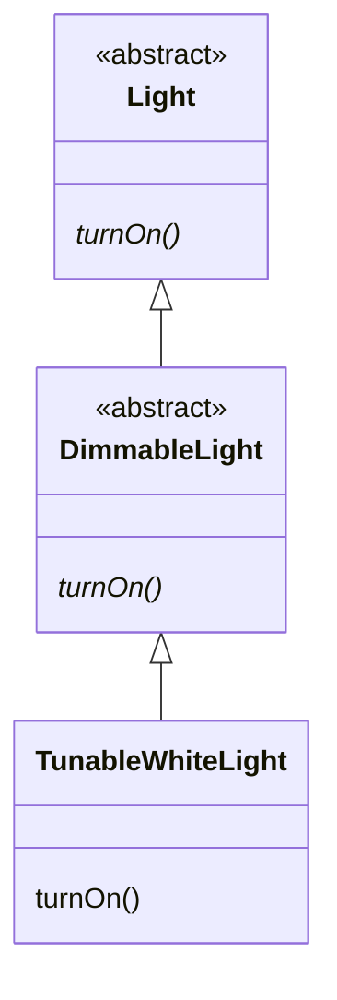

import RevealJS, { Slide } from '@site/src/components/RevealJS';
import Img from '@site/src/components/Img';
import PollSlide from '@site/src/components/PollSlide';
import QuoteSlide from '@site/src/components/QuoteSlide';
import QuizSlide from '@site/src/components/QuizSlide';

<style>
{`
  .reveal {
    font-size: 32px;
  }
`}
</style>

<RevealJS transition="slide">

<Slide>

# CS 3100: Program Design and Implementation II

## Final Review

<p style={{marginTop: '0em', fontSize: '0.7em', color: '#666'}}>
  ©2026 Ellen Spertus, CC-BY-SA
</p>
</Slide>

<Slide>

## Poll: How much of the practice final did you do?

<PollSlide choices=
  {["None yet", "I've skimmed it", "A few problems", "Many problems", "All problems"]}
/>
</Slide>

<Slide>

## Poll: How hard do you think it is?

<PollSlide image="/img/lectures/poll-ev/pollev-smiles.png"
/>
<p>
Click below the faces if you haven't tried it yet.
</p>
</Slide>

<Slide>

## Question 1

The SceneItAll IoT hierarchy from lecture is:

```
IoTDevice              <<interface>>
└── BaseIoTDevice      <<abstract>>
    ├── Fan
    └── Light          <<abstract>>
        ├── SwitchedLight
        └── DimmableLight
            └── TunableWhiteLight
```

Consider this code:

```java
Light light = new TunableWhiteLight("living-room", 2700, 100);
((DimmableLight) light).turnOn();
```

`TunableWhiteLight` overrides `turnOn()`. Which version of `turnOn()` is called?


</Slide>

<Slide>
### Draw a Picture Before Viewing Choices

<div style={{display: 'flex', gap: '2em', justifyContent: 'center'}}>
  <div>

</div>

<div className='fragment' style={{ fontSize: '.8em' }}>
Which version of `turnOn()` is called?

A. DimmableLight\'s turnOn(), because the cast changes the runtime type of light to DimmableLight

B. Light\'s turnOn(), because Light is the declared type of light and static dispatch resolves to it

C. A compilation error occurs because you cannot cast a Light reference to a DimmableLight subtype

D. TunableWhiteLight\'s turnOn(), because dynamic dispatch resolves calls using the object\'s runtime type


<div className='fragment' style={{backgroundColor: '#fde8e8', borderRadius: '6px', padding: '0.5em 1em'}}>
Java uses *dynamic dispatch*, so the dynamic (run-time) type is used.
</div>

</div>

</div>
```java
Light light = new TunableWhiteLight("living-room", 2700, 100);
((DimmableLight) light).turnOn();
```

<div className='fragment'>
Answer is D. Review Lab 6.5 if needed.
</div>

</Slide>

<Slide>

## Question 2

```java
public class Example {
    int x = 10;

    public static void printX() {
        System.out.println(x);
    }
}
```

<div className='fragment' style={{ fontSize: '.8em' }}>

What is wrong with this code?

A. `x` should be `public` for a static method to access it

B. Static methods cannot reference instance variables directly

C. `println` cannot print an `int`

D. `x` must be declared `final` before a static method can use it

<div className='fragment' style={{backgroundColor: '#fde8e8', borderRadius: '6px', padding: '0.5em 1em'}}>

`x` is an *instance variable*. It belongs to instances of `Example`.

`printX()` is `static`, so it has no `this` reference and cannot access instance variable `x`.

</div>

<div className='fragment'>
Answer is B. Review Lab 6.5 if needed.
</div>

</div>

</Slide>
<Slide>

## Question 3

Two versions of SceneItAll store controlled devices differently:

- **Version A:** `List<Device>` — membership tested with a for-each loop
- **Version B:** `HashSet<Device>` — membership tested with `contains()`

What is the Big-O performance of each?

<div className='fragment' >

A. Both are O(n)

B. Version A is O(n) and Version B is O(1)

C. Version A is O(n) and Version B is O(log n)

D. Both are O(1) because Java's JIT compiler optimizes small-collection lookups to run in constant time regardless of data structure

<div className='fragment' style={{backgroundColor: '#fde8e8', borderRadius: '6px', padding: '0.5em 1em'}}>

A for-each scan is O(n); `HashSet.contains()` uses hashing to find the element in O(1) time.

</div>

</div>

<div className='fragment'>
Answer is B. See [L37 Performance: Big-O in SceneItAll](https://neu-pdi.github.io/cs3100-public-resources/lecture-slides-spertus/l37-recent-topics#/7) for complexities you should know.
</div>

</Slide>

<Slide>
### Hashtables


<div className='fragment'>
(But use `HashMap`, not `Hashtable`.)
</div>
</Slide>

<Slide>

## Question 4
<div style={{ fontSize: '.8em' }}>

In a `@NullMarked` package, a developer writes the following method:

```java
public String formatIngredient(@Nullable String prefix, String name) {
    if (prefix == null) {
        return name;
    }
    return prefix + " " + name;
}
```
Which statement about this signature is correct?
<div className='fragment'>

A. `name` is assumed non-null because the package is `@NullMarked`; passing `null` for `name` would produce a compile-time warning or error

B. The `@Nullable` annotation on `prefix` is redundant because all parameters are nullable by default in Java

C. `@Nullable` on `prefix` means the nullness checker will throw a `NullPointerException` automatically if `null` is passed

D. Both `prefix` and `name` are treated as nullable because `@Nullable` anywhere in a method signature marks all parameters as nullable

</div>
<div className='fragment' style={{backgroundColor: '#fde8e8', borderRadius: '6px', padding: '0.5em 1em'}}>
As the name `@NullMarked` suggests, any types that can have null values are marked `@Nullable`. Answer is A.
</div>

</div>
</Slide>

<Slide>

## Question 5


Why can you use HashMap in your programs without reading its 2000-line implementation?
<div style={{ fontSize: '.8em' }}>
A. The Java compiler inlines HashMap's implementation at compile time, so you never need to read it

B. HashMap's specification tells you exactly what each method does, letting you treat it as a single mental chunk without understanding its internals

C. HashMap's implementation is hidden using private fields, so the compiler prevents you from accessing it

D. You don't need to read HashMap because you know it implements the Map interface and all Map implementations behave identically
</div>
<div className='fragment' style={{backgroundColor: '#fde8e8', borderRadius: '6px', padding: '0.5em 1em'}}>
We can read specifications instead of source code. Answer B is correct.
</div>

<div className='fragment'>
🦨 Answer D is close to true.
</div>

</Slide>

<Slide>

## Question 6

```java
List lights = new ArrayList<>(List.of(
    new DimmableLight("bedroom", 80),
    new DimmableLight("kitchen", 30),
    new DimmableLight("bedroom", 50)
));

lights.sort(Comparator.comparing(DimmableLight::getId)
                      .thenComparingInt(DimmableLight::getBrightness));

System.out.println(lights);
```

Assuming `toString()` returns just the id and brightness (e.g., `"bedroom/80"` ), what is
printed?

<div className='fragment' style={{ fontSize: '.8em' }}>

A. `[bedroom/50, bedroom/80, kitchen/30]` — sorted by id first, then brightness ascending within the same id

B. `[bedroom/80, bedroom/50, kitchen/30]` — sorted by id first, preserving original order within ties

C. `[kitchen/30, bedroom/50, bedroom/80]` — sorted by brightness ascending

D. `[bedroom/80, kitchen/30, bedroom/50]` — original order, unchanged

<div className='fragment' style={{backgroundColor: '#fde8e8', fontSize: '.95em', borderRadius: '6px', padding: '0.3em 0.3em'}}>

`Comparator.comparing()` sorts by [increasing] id first; `thenComparingInt()` breaks ties by [increasing] brightness.
Answer is A.

</div>

</div>

</Slide>
<Slide>

## Question 7
A developer writes this filter:

```java
devices.stream()
    .filter(d -> d.isConnected() && d.getBattery() < 20
                 && !d.getType().equals("wired")
                 && d.getLastSeen().isBefore(cutoff))
    .collect(Collectors.toList());
```

What refactoring would most increase testability?

<div className='fragment' style={{backgroundColor: '#fde8e8', fontSize: '.95em', borderRadius: '6px', padding: '0.3em 0.3em'}}>

Pay close attention to the wording! This is asking about *testability*.
</div>

<div className='fragment'>
A. Extracting the lambda body into a named method
</div>

<div className='fragment' style={{display: 'flex', gap: '2em', justifyContent: 'center'}}>
  <div>
```java
devices.stream()
    .filter(this::isLowBatteryWireless)
    .collect(Collectors.toList());
```
</div>
<div>
```
boolean isLowBatteryWireless(Device d) {
    return d.isConnected()
        && d.getBattery() < 20
        && !d.getType().equals("wired")
        && d.getLastSeen().isBefore(cutoff);
}
```
</div>
</div>

</Slide>


<Slide>

### Question 7 Answers
A developer writes this filter:

```java
devices.stream()
    .filter(d -> d.isConnected() && d.getBattery() < 20
                 && !d.getType().equals("wired")
                 && d.getLastSeen().isBefore(cutoff))
    .collect(Collectors.toList());
```

What refactoring would most increase testability?

<div style={{ fontSize: '.8em' }}>

A. Extracting the lambda body into a named method

B. Replacing `Collectors.toList()` with `Collectors.toUnmodifiableList()` so the result cannot be accidentally mutated by callers

C. Splitting the filter into multiple chained `.filter()` calls, one condition per call

D. Converting the lambda body into an anonymous class

<div className='fragment' style={{backgroundColor: '#fde8e8', borderRadius: '6px', padding: '0.5em 1em'}}>

Complex lambda logic should be extracted into a named method for readability, documentation, and independent testability. Answer is A.

</div>

</div>

</Slide>

<Slide>

## Question 8

A developer writes `LoggingList`, a subclass of `ArrayList` that counts how many elements have been added:

<div style={{display: 'flex', gap: '2em', justifyContent: 'center'}}>
  <div>
```java
public class LoggingList<E> extends ArrayList<E> {
  private int addCount = 0;

  @Override
  public boolean add(E e) {
    addCount++;
    return super.add(e);
  }

  @Override
  public boolean addAll(Collection<? extends E> c) {
    addCount += c.size();
    return super.addAll(c);
  }

  /**
   * Gets the count of items added to this list
   * (whether or not they are subsequently removed).
   *
   * @return the number of items added to the list
   */
  public int getAddCount() { return addCount; }
}
```
  </div>
  <div className='fragment'>
Both of these JUnit tests pass:

```java
@Test
void countsTwoDirectAdds() {
  LoggingList<String> list = new LoggingList<>();
  list.add("A");
  list.add("B");
  assertEquals(2, list.getAddCount());
}

@Test
void countsAddAll() {
  LoggingList<String> list = new LoggingList<>();
  list.addAll(Arrays.asList("A", "B", "C"));
  assertEquals(3, list.getAddCount());
}
```
  </div>
</div>
<div className='fragment'>
What is the problem with `LoggingList`?
</div>
</Slide>

<Slide>

### Question 8 Answers
<div style={{ fontSize: '.8em' }}>

A developer writes `LoggingList`, a subclass of `ArrayList` that counts how many elements have been added:

```java
public class LoggingList<E> extends ArrayList<E> {
  private int addCount = 0;

  @Override
  public boolean add(E e) { .. }

  @Override
  public boolean addAll(Collection<? extends E> c) { .. }

  public int getAddCount() { return addCount; }
}
```
What is the problem with `LoggingList`?

A. `addCount` should be `static` so it is shared across all `LoggingList` instances<br/>
B. The class might no longer satisfy its specification if the implementation of `ArrayList` changes<br/>
C. Overriding both `add()` and `addAll()` violates the Interface Segregation Principle because the two methods should be in separate interfaces<br/>
D. The class violates the Liskov Substitution Principle because `LoggingList` cannot be used anywhere an `ArrayList` is expected<br/>

<div className='fragment' style={{backgroundColor: '#fde8e8', borderRadius: '6px', padding: '0.5em 1em'}}>
Implementation assumes `super.addAll()` does not call `add()`. Answer is B.
</div>

</div>

</Slide>

<Slide>

## Question 9

```java
@Test
public void activatesHeatingWhenBelowTarget() {
    TemperatureSensor mockSensor = mock(TemperatureSensor.class);
    HVACService mockHVAC = mock(HVACService.class);
    when(mockSensor.readTemperature("livingRoom")).thenReturn(65.0);

    ThermostatController controller = new ThermostatController(mockSensor, mockHVAC);
    controller.adjustToTargetTemperature(72.0, "livingRoom");

    verify(mockHVAC).activate("livingRoom");
}
```

What does `verify(mockHVAC).activate("livingRoom")` do?


</Slide>


<Slide>

### Make Sure We Understand Code

```java
@Test
// This tests whether the heater is turned on when we want to heat room.
public void activatesHeatingWhenBelowTarget() {
  // Create a test double for the TemperatureSensor.
  TemperatureSensor mockSensor = mock(TemperatureSensor.class);

  // Create a test double for the HVACService.
  HVACService mockHVAC = mock(HVACService.class);

  // Simulate a living room temperature of 65.0.
  when(mockSensor.readTemperature("livingRoom")).thenReturn(65.0);

  // Create a real ThermostatController using the doubles.
  ThermostatController controller = new ThermostatController(mockSensor, mockHVAC);

  // Test what happens when we tell a ThermostatController to increase LR temperature.
  controller.adjustToTargetTemperature(72.0, "livingRoom");
  // Make sure the HVACService's activate() method was called with argument "livingRoom".
  verify(mockHVAC).activate("livingRoom");
}
```

What does `verify(mockHVAC).activate("livingRoom")` do?


</Slide>

<Slide>

### Question 9 Answers

What does `verify(mockHVAC).activate("livingRoom")` do?

<div style={{ fontSize: '.8em' }}>

A. It asserts that `activate` was called exactly once with `"livingRoom"` as the argument

B. It configures the mock to return a specific value the next time `activate` is called

C. It checks that `mockHVAC` was originally constructed using `"livingRoom"` as a parameter

D. It registers a callback so that a real HVAC system is contacted if `activate` is called

<div className='fragment' style={{backgroundColor: '#fde8e8', borderRadius: '6px', padding: '0.5em 1em'}}>

`verify` asserts the method was called exactly once with the specified argument. Answer is A.

</div>

<div className='fragment'>
🦨 You shouldn't be expected to remember "exactly once".
</div>

</div>

</Slide>

<Slide>

## Question 10: Static Calls and Testability

<QuizSlide
  question='A developer wants to test that doWork() is NOT called outside business hours in a class whose runIfDue() method checks TimeUtils.isBusinessHours() (a static call). What is the fundamental testing problem that prevents the developer from even setting up the test scenario?'
  answers={[
    'doWork() is private, so neither JUnit nor Mockito can invoke it directly within a test',
    'TimeUtils.isBusinessHours() is a static call and cannot be replaced with a test double',
    'The class has no explicit constructor, so Mockito cannot create a mock of ScheduledTask',
    'runIfDue() returns void, so there is no return value to assert on in the test']}/>
</Slide>

<Slide>

## Question 11: Modular Monolith

<QuizSlide
  question="A team adopts a modular monolith where the Submissions module and Grading module communicate only through each module\'s public API, never querying each other\'s tables directly. What is the primary benefit compared to an unstructured monolith?"
  answers={[
    'It eliminates network latency between modules and allows each module\'s schema to evolve independently',
    'It guarantees independent deployment cycles so each module can be released on its own schedule',
    'It preserves clean boundaries that make it easier to extract a module into a separate service later',
    'It prevents any single bug from crashing the entire application by running modules in separate processes']}/>
</Slide>

<Slide>

## Question 12: Fallacies of Distributed Computing

<QuizSlide
  question="Pawtograder\'s Grading Action batches all 100 test results into a single submitFeedback() call instead of one call per result. Which fallacy of distributed computing most directly motivates this?"
  answers={[
    '"Latency is zero" — making 100 sequential network round-trips would add significant cumulative delay that a single batch avoids',
    '"There is one administrator" — separate calls per result may each be subject to different rate limits or firewall policies',
    '"The network is secure" — sending results individually exposes more data at each trust boundary crossing',
    '"The network is homogeneous" — individual calls may take different paths and behave inconsistently across network segments']}/>
</Slide>

<Slide>

## Question 13: Functions as a Service

<QuizSlide
  question='When using a Functions as a Service (FaaS) platform instead of managing your own server, which of the following does the programmer still control?'
  answers={[
    'The operating system configuration',
    'The algorithm used within the function',
    'The physical server hardware the function runs on',
    'How the server scales under load']}/>
</Slide>

<Slide>

## Question 14: Open-Source Licensing

<QuizSlide
  question='A startup evaluates two libraries for a desktop application it distributes to customers. Library A uses MIT; Library B uses GPL v3. Which accurately describes the licensing risk of choosing Library B?'
  answers={[
    'The startup must credit Library B authors in all marketing materials but can otherwise keep its source code proprietary',
    'The startup may use Library B freely for internal tools but must pay a licensing fee before any commercial distribution',
    'Library B is prohibited from use in any commercial product regardless of whether source code is made available',
    'Distributing software that includes Library B requires the startup to release its own source code under the GPL']}/>
</Slide>

<Slide>

## Question 15: Nielsen Heuristics

<QuizSlide
  question='In one version of CookYourBooks, to scale a recipe users must type the target serving count but are not shown the original serving size — they must remember it from the previous screen. Which Nielsen heuristic is violated?'
  answers={[
    'H6 (Recognition Rather Than Recall) — display the original serving size on the scaling screen',
    'H3 (User Control and Freedom) — add an Undo button',
    'H5 (Error Prevention) — validate that the target is a positive integer',
    'H2 (Match Between System and the Real World) — replace the number field with natural language']}/>
</Slide>

<Slide>

## Question 16: POUR Principles

<QuizSlide
  question='In another version of CookYourBooks, recipe difficulty is displayed using colored dots (green/yellow/red) with no text labels or shapes. Which POUR principle is violated?'
  answers={[
    'Operable, because users with motor impairments are unable to reliably interact with an indicator that provides no keyboard-accessible target',
    'Robust, because the colored dots use a non-standard HTML element that will render differently across Chrome, Safari, and Firefox',
    'Perceivable, because colorblind users cannot distinguish the levels if color is the only differentiating attribute',
    'Understandable, because the green/yellow/red color metaphor carries different cultural meanings in different regions and contexts']}/>
</Slide>

<Slide>

## Question 17: JavaFX Event Callbacks

<QuizSlide
  question='Consider this JavaFX code:

submitButton.setOnAction(event -> {
    System.out.println("Submitted");
});
System.out.println("Button registered");

In what order do "Button registered" and "Submitted" appear in the console?'
  answers={[
    '"Button registered" first, then "Submitted" when the user clicks — the callback is invoked by the event loop',
    '"Submitted" first — the callback runs immediately when setOnAction is called, before registration returns',
    'Both run simultaneously on separate threads because JavaFX uses a background event dispatcher',
    '"Button registered" first, then "Submitted" immediately after on the same call stack, without waiting for user input']}/>
</Slide>

<Slide>

## Question 18: MVC

<QuizSlide
  question="Version A\'s button handler manually iterates over ingredients and calls ing.scale(factor). Version B\'s handler calls model.scale(servings) and then updates the view. Which better follows MVC?"
  answers={[
    'Version A, because it gives the Controller direct control over scaling each ingredient',
    'Version B, because scaling logic belongs in the Model; the Controller should delegate',
    'Version A, because the Controller should perform all computation to keep the Model simple',
    'Version B, because bidirectional data binding between Model and View ensures the ingredient list updates automatically']}/>
</Slide>

<Slide>

## Question 19: MVVM Testability

<QuizSlide
  question='In MVVM, a test sets a property on the ViewModel and verifies the result without simulating a button click or starting a UI. Why does this work?'
  answers={[
    'TestFX automatically intercepts ViewModel property changes and triggers bound assertions without requiring explicit verification calls',
    'The test bypasses the ViewModel entirely and calls Recipe.scale() directly on the Model, so no UI component is needed',
    'JavaFX property bindings are evaluated lazily, so the test assertion runs before the UI thread has processed the update',
    'The ViewModel exposes observable properties settable in tests, because it holds no reference to the View']}/>
</Slide>

<Slide>

## Question 20: Thread Safety

<QuizSlide
  question='A DeviceRegistry has private int deviceCount = 0 and registerDevice() does deviceCount++. Ten threads each call registerDevice() once. Why might getDeviceCount() return less than 10?'
  answers={[
    'int is not valid for shared mutable fields; only long or AtomicInteger support safe multi-threaded reads',
    'Java guarantees int reads are atomic, so the problem must be a visibility issue from CPU cache coherence delays',
    'The JVM silently rounds down concurrent increments for performance, discarding some writes when contention is high',
    'deviceCount++ is not atomic — it reads, increments, and writes in three steps, so two threads may read the same stale value']}/>
</Slide>

<Slide>

## Question 21: Deadlock

<QuizSlide
  question='activateScene() synchronizes on room then device. firmwareUpdate() synchronizes on device then room. Thread A runs activateScene() while Thread B runs firmwareUpdate(). What happens?'
  answers={[
    'Thread B completes first because it acquires fewer locks and thus encounters less contention',
    'Both proceed normally because synchronized blocks on different object instances never interact',
    'A deadlock can occur: Thread A holds room and waits for device; Thread B holds device and waits for room',
    'A race condition corrupts device state because synchronized only protects accesses to primitive fields']}/>
</Slide>

<Slide>

## Question 22: Blocking the FX Thread

<QuizSlide
  question="In a CookYourBooks JavaFX app, a button click triggers a database search that takes 2 seconds. A student puts the database call directly in the button\'s action handler. What happens?"
  answers={[
    'The search runs in parallel with the UI on a separate thread automatically created by JavaFX',
    'The UI freezes for 2 seconds because the FX thread is blocked waiting for the database',
    'JavaFX detects the slow operation and moves it to a background thread automatically',
    'The search completes immediately because JavaFX caches database results']}/>
</Slide>

<Slide>

## Question 23: BackgroundTaskRunner and onSuccess

<QuizSlide
  question='In BackgroundTaskRunner, the onSuccess callback always runs on the FX Application Thread rather than on the background thread that produced the result. Why?'
  answers={[
    'The FX thread is faster than background threads for processing data',
    'Background threads are terminated immediately after the callable returns, so they cannot run callbacks',
    'Running onSuccess on the FX thread enables the callback to update the UI',
    'Running onSuccess on the FX thread prevents the callable from being cancelled mid-execution']}/>
</Slide>

<Slide>

## Question 24: BackgroundTaskRunner Execution Order

<QuizSlide
  question='Consider:

BackgroundTaskRunner.run(
    () -> loadRecipes(),     // takes 2 seconds
    recipes -> showRecipes(recipes),
    error -> showError(error)
);
log("Ready");

Assuming loadRecipes() succeeds, in what order do these events occur?'
  answers={[
    'loadRecipes() runs, then showRecipes() runs, then "Ready" is logged — all on the FX thread in sequence',
    '"Ready" is logged on the FX thread, then loadRecipes() runs on a background thread, then showRecipes() runs on the FX thread',
    'loadRecipes() and log("Ready") run simultaneously on separate threads, then showRecipes() runs',
    '"Ready" is logged, then loadRecipes() runs, then showRecipes() runs — all on the background thread']}/>
</Slide>

<Slide>

## Question 25: FX Thread vs. Background Thread

<QuizSlide
  question='A developer wants to build a responsive JavaFX application. Which of these operations can be done equally well on either the FX Application Thread or a background thread?'
  answers={[
    'Changing the GUI display between dark mode and light mode',
    'Cutting power to all devices',
    'Calling the library routine to get the time of day',
    'Backing up all data to a server']}/>
</Slide>

<Slide>
## Bonus Slide


</Slide>

</RevealJS>